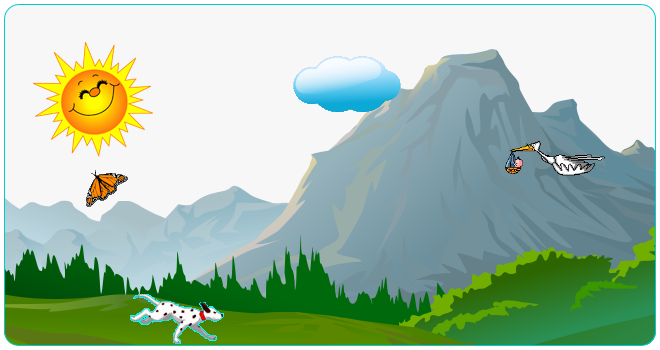

# Marquee

This application uses a mix of HTML and CSS to display animation. To
achieve this dynamic, moving scene, marquees and CSS are put into action. In the animation,
the user will see a dog running, a butterfly and a stork flying, and finally a sun and cloud floating
over a mountain background. Here is a visual of what the application looks like:

*The image above is a snapshot of what the animation looks like on a web page.*

Live Demo: https://stellagurin.github.io/Marquee/